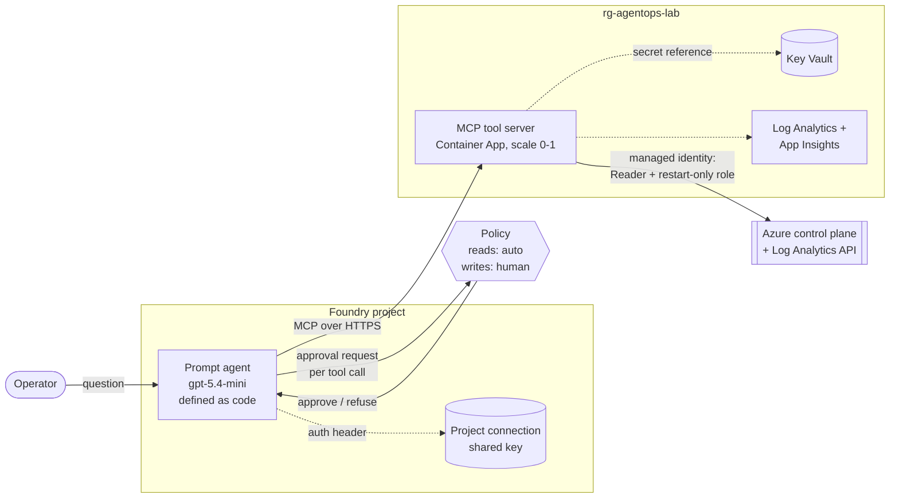

# Agentic ops copilot

An AI agent that investigates Azure infrastructure by calling real tools, and that **cannot change anything without a human approving it**.

The agent runs on Microsoft Foundry Agent Service. Its tools come from an MCP server I wrote, which reaches Azure with a managed identity that can read the estate and perform exactly one write: restarting a container app revision. Every tool call comes back for approval; a policy in the client approves reads and refuses writes unless a person allows them. The model never approves its own actions.



## What this demonstrates

| Area | How it's done here |
|---|---|
| **Agentic AI on Azure** | A Foundry prompt agent defined in code (`agents/ops_agent.py`), versioned in git and published by the pipeline. Its instructions require evidence before conclusions. |
| **MCP in practice** | A tool server I wrote (`mcp/server.py`), registered with the agent as an MCP server and authenticated through a Foundry project connection. |
| **Human-in-the-loop** | Every tool call returns an approval request. Reads are auto-approved; writes and any *unrecognized* tool are refused unless a human allows them. Tested in `agents/tests/test_ask.py`. |
| **Least privilege, twice over** | The tool server's identity holds Reader plus a custom role whose only action is `Microsoft.App/containerApps/revisions/restart/action`. Even if the agent were talked into anything else, Azure would refuse. |
| **Infrastructure as code** | Terraform for the Foundry account, project, model, tool server, identities, and the agent's auth connection. The observability and Key Vault modules are consumed from the [landing zone lab](https://github.com/zuqdah/azure-agent-landing-zone) at pinned tags. |
| **Cost control** | Prompt agents add no compute cost, the tool server scales to zero, logs are capped, deploys are manual, and a nightly teardown removes everything. |

## The approval gate

The gate is the point of the lab, so it is worth being precise about where the decision is made.

1. The agent decides it wants to call a tool.
2. Foundry pauses and returns an `mcp_approval_request` naming the tool and its arguments.
3. **The client decides**, in `agents/ask.py`: a tool on the read-only list is approved; anything else is refused unless the caller passed `--allow-writes`, which stands in for a person pressing approve.
4. The decision goes back to Foundry, and only approved calls ever reach the tool server.

An unrecognized tool name is treated as a write. If a future version of the server exposes something new, it is refused by default rather than auto-approved.

```bash
# Reads run on their own
python ask.py "Which container apps are in the resource group, and are they healthy?"

# A write is requested and refused
python ask.py "Restart the tool server container app now."

# A human allows it
python ask.py "Restart the tool server container app now." --allow-writes
```

## Tools the agent has

| Tool | Access | What it does |
|---|---|---|
| `list_resources` | read | Every resource in the lab resource group |
| `container_app_status` | read | Provisioning state, running status, active revision, URL |
| `query_logs` | read | A Kusto query against Log Analytics, capped at 50 rows and 24 hours |
| `restart_container_app` | **write, approval required** | Restarts the active revision of one container app |

Scope guards live in the server, not the prompt: resource names are validated against a strict pattern, every call is confined to one resource group, and query size and time range are bounded.

## Repository layout

```
bootstrap/          One-time setup: state, GitHub OIDC identity, restart-only role
infra/              Foundry project, model, tool server, identities, connection
modules/
  foundry/          AIServices account + project + model deployment
  tool-server/      Container app for the MCP server
mcp/                The MCP tool server and its tests
agents/             Agent definition, approval-gate client, and its tests
.github/workflows/  CI, Deploy (manual), Destroy (manual + nightly)
```

## Cost

Pay-as-you-go retail rates, East US 2, September 2026.

| Resource | Rate | Lab cost |
|---|---|---|
| Foundry prompt agent | No charge beyond model tokens and tool usage | $0 |
| gpt-5.4-mini (Data Zone Standard) | $0.825 per 1M input, $4.95 per 1M output | Cents per investigation |
| Container Apps (Consumption) | Scales to zero | ~$0 within the monthly free grant |
| Log Analytics | First 5 GB/month free | $0; capped at 0.1 GB/day |
| Key Vault | $0.03 per 10K operations | ~$0 |

An agent turn costs more than a single chat call because tool results are fed back to the model. The model deployment's capacity is capped at 5K tokens per minute, and the nightly teardown bounds everything else.

## How to run it

**Prerequisites:** Terraform 1.9+, Azure CLI, an Azure subscription where you're Owner, and a fork of this repository.

1. **Bootstrap** (once), after creating the repository so its IDs exist:
   ```bash
   az login
   cd bootstrap
   terraform init
   terraform apply \
     -var='github_repository=<owner>/<repo>' \
     -var="github_repository_owner_id=$(gh api repos/<owner>/<repo> --jq .owner.id)" \
     -var="github_repository_id=$(gh api repos/<owner>/<repo> --jq .id)"
   ```
2. **Configure GitHub.** Create an environment named `lab`, then add these repository variables from the bootstrap outputs. None are secrets: `AZURE_CLIENT_ID`, `AZURE_TENANT_ID`, `AZURE_SUBSCRIPTION_ID`, `TFSTATE_RESOURCE_GROUP`, `TFSTATE_STORAGE_ACCOUNT`, `TFSTATE_CONTAINER`, `LAB_RESOURCE_GROUP`, `RESTART_ROLE_DEFINITION_ID`.
3. **Deploy.** Run the **Deploy** workflow. It builds the tool server, applies Terraform, publishes the agent, then verifies both the read path and the approval gate.
4. **Tear down.** Run **Destroy**, or let the nightly schedule do it.

## Design decisions

- **Prompt agent, not a hosted agent.** A prompt agent is configuration that Foundry runs, so there is no container to host and no idle cost. A hosted agent (Microsoft Agent Framework, multi-agent handoff) adds a container registry and per-session compute; that is the next lab, not this one.
- **Approval decided by the client, not the model.** `require_approval="always"` sends every call back, and policy in code decides. Asking a model to respect its own guardrail is not a guardrail.
- **A custom role for one action.** Reader plus `restart/action` means the blast radius is bounded by Azure, independent of prompt or policy bugs.
- **REST instead of Azure SDKs in the tool server.** Three SDKs would be three version surfaces to track; the REST calls are pinned to explicit API versions and are readable in one file.
- **Shared modules by tag.** Observability and Key Vault come from the landing zone lab at `v1.1.0` and `v1.0.0`. Reuse without copy-paste, and version changes are deliberate.

## Part of a series

This lab builds on the [Azure agent landing zone](https://github.com/zuqdah/azure-agent-landing-zone). More at [ziyaduqdah.com](https://ziyaduqdah.com/#labs).
